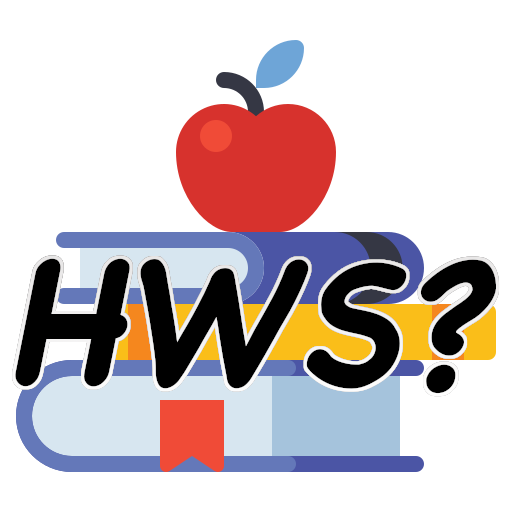

<<<<<<< HEAD
Ongoing project and will continue to add more features in the future.

 # How was School 

---

## Table of Contents

- [Description](#description)
- [How To Use](#how-to-use)
- [References](#references)
- [License](#license)
- [Author Info](#author-info)

---

### Description

This is our Hackathon project called How Was School. It was an app built to help beter involve parents with what is going on in school with their kids especially with the pandemic going on most kids have transitioned into remote schooling. We currently have available a tutor, calendar, and donations page with a more fully functioning calendar api implemented.

#### Technologies

- JavaScript
- NodeJs
- HTML5 & CSS 
- SASS
- VS code

[Back To The Top](#read-me-template)

##### How To Use
- To run this project, install it locally using npm:
cd ../How-was-school
- Run npm i 
- run npm i 
     @sendgrid/mail
    body-parser
    dotenv
    ejs
    express
    mongoose
    morgan
    paypal-rest-sdk
    request

# Future updates

We would like to update the contact and Tutor page to other API's so we could have the forms working. The Hamburger Navbar would also include more features and pages in the future. 

[Back To The Top](#read-me-template)

---

## References

https://www.youtube.com/watch?v=7k03jobKGXM&feature=youtu.be&ab_channel=TraversyMedia

https://www.youtube.com/watch?v=zrLf4KMs71E&feature=youtu.be&ab_channel=TheLifeOfADev

https://www.youtube.com/watch?v=zb3Qk8SG5Ms&ab_channel=TheNetNinja

[Back To The Top](#read-me-template)

---

### License

MIT License

Copyright (c) [2020] [HWS]

Permission is hereby granted, free of charge, to any person obtaining a copy
of this software and associated documentation files (the "Software"), to deal
in the Software without restriction, including without limitation the rights
to use, copy, modify, merge, publish, distribute, sublicense, and/or sell
copies of the Software, and to permit persons to whom the Software is
furnished to do so, subject to the following conditions:

The above copyright notice and this permission notice shall be included in all
copies or substantial portions of the Software.

THE SOFTWARE IS PROVIDED "AS IS", WITHOUT WARRANTY OF ANY KIND, EXPRESS OR
IMPLIED, INCLUDING BUT NOT LIMITED TO THE WARRANTIES OF MERCHANTABILITY,
FITNESS FOR A PARTICULAR PURPOSE AND NONINFRINGEMENT. IN NO EVENT SHALL THE
AUTHORS OR COPYRIGHT HOLDERS BE LIABLE FOR ANY CLAIM, DAMAGES OR OTHER
LIABILITY, WHETHER IN AN ACTION OF CONTRACT, TORT OR OTHERWISE, ARISING FROM,
OUT OF OR IN CONNECTION WITH THE SOFTWARE OR THE USE OR OTHER DEALINGS IN THE
SOFTWARE.

=======

Ongoing project and will continue to add more features in the future.

 # How was School 

---

## Table of Contents

- [Description](#description)
- [How To Use](#how-to-use)
- [References](#references)
- [License](#license)
- [Author Info](#author-info)

---

### Description

This is our Hackathon project called How Was School. It was an app built to help beter involve parents with what is going on in school with their kids especially with the pandemic going on most kids have transitioned into remote schooling. We currently have available a tutor, calendar, and donations page with a more fully functioning calendar api implemented.

#### Technologies

- JavaScript
- NodeJs
- HTML5 & CSS 
- SASS
- VS code

[Back To The Top](#read-me-template)

##### How To Use
- To run this project, install it locally using npm:
cd ../How-was-school
- Run npm i 
- run npm i 
     @sendgrid/mail
    body-parser
    dotenv
    ejs
    express
    mongoose
    morgan
    paypal-rest-sdk
    request

# Future updates

We would like to update the contact and Tutor page to other API's so we could have the forms working. The Hamburger Navbar would also include more features and pages in the future. 

[Back To The Top](#read-me-template)

---

## References

https://www.youtube.com/watch?v=7k03jobKGXM&feature=youtu.be&ab_channel=TraversyMedia

https://www.youtube.com/watch?v=zrLf4KMs71E&feature=youtu.be&ab_channel=TheLifeOfADev

https://www.youtube.com/watch?v=zb3Qk8SG5Ms&ab_channel=TheNetNinja

[Back To The Top](#read-me-template)

---
/Users/aaronmoua/Downloads/read-me-template-master/hwslogo.png
### License

MIT License

Copyright (c) [2020] [HWS]

Permission is hereby granted, free of charge, to any person obtaining a copy
of this software and associated documentation files (the "Software"), to deal
in the Software without restriction, including without limitation the rights
to use, copy, modify, merge, publish, distribute, sublicense, and/or sell
copies of the Software, and to permit persons to whom the Software is
furnished to do so, subject to the following conditions:

The above copyright notice and this permission notice shall be included in all
copies or substantial portions of the Software.

THE SOFTWARE IS PROVIDED "AS IS", WITHOUT WARRANTY OF ANY KIND, EXPRESS OR
IMPLIED, INCLUDING BUT NOT LIMITED TO THE WARRANTIES OF MERCHANTABILITY,
FITNESS FOR A PARTICULAR PURPOSE AND NONINFRINGEMENT. IN NO EVENT SHALL THE
AUTHORS OR COPYRIGHT HOLDERS BE LIABLE FOR ANY CLAIM, DAMAGES OR OTHER
LIABILITY, WHETHER IN AN ACTION OF CONTRACT, TORT OR OTHERWISE, ARISING FROM,
OUT OF OR IN CONNECTION WITH THE SOFTWARE OR THE USE OR OTHER DEALINGS IN THE
SOFTWARE.

>>>>>>> 382a3ec8742145d9f1a731a40cfe6bc28ea40626
